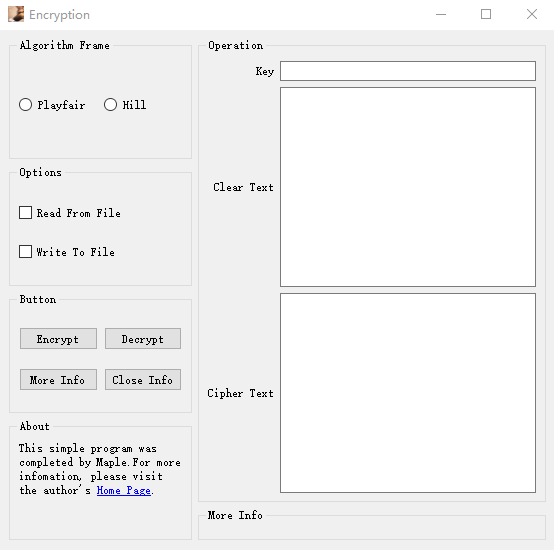

# Encrypt

`Encrypt` is an tool based on QT 5.7 for user who could use several encryption algorithm, such as **Playfair**, **Hill** and **RSA**, to encrypt private datas.

# Platform

This program was built on Win 10, x86_64. The execute program named PlayFair is under directory `Encryption`.
For building it on other platform, you could clone and rebuild it by using *Qt Creator 4.3*.

# Screenshot

## Main Window

## Playfair 

### Encryption

### Decryption

## Hill Encryption

### Encryption

### Decryption

## RSA Encryption

### Encryption

## Encryption From File

### Playfair as example

